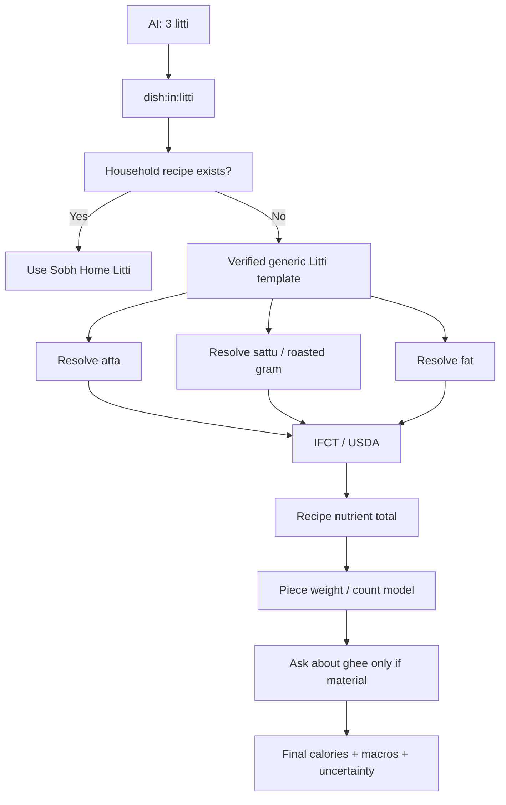
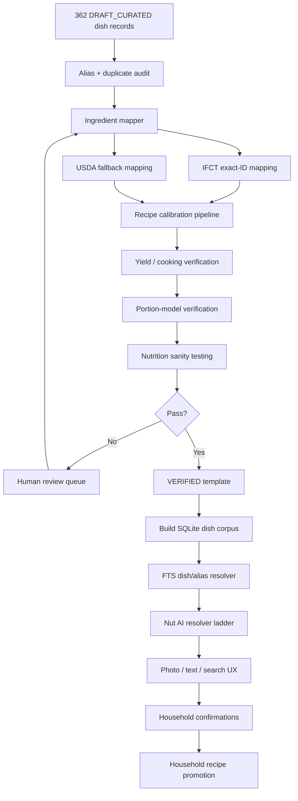

# Indian Dish Knowledge Base: Detailed Seed Corpus

## Executive summary

I generated **362 detailed Indian dish records**, exceeding the requested minimum of 300.

This is not merely a list of dish names. Each record is structured for the Indian Dish Knowledge Base we designed for Nut AI and contains:

| Per-dish field | Included |
|---|---:|
| Stable canonical ID | ✅ |
| Canonical dish name | ✅ |
| Known aliases/search names | ✅ |
| Regional coverage tags | ✅ |
| Dish category | ✅ |
| Dish family | ✅ |
| Priority batch | ✅ |
| Cooking methods | ✅ |
| Base family components | ✅ |
| Dish-specific components | ✅ |
| Ingredient slots | ✅ |
| Broad ingredient-amount priors | ✅ |
| IFCT → USDA resolution preference | ✅ |
| Yield strategy | ✅ |
| Portion strategies | ✅ |
| High-impact uncertainty variables | ✅ |
| Added-fat model | ✅ |
| Clarification policy | ✅ |
| Resolver behaviour | ✅ |
| Household-learning/promotion rules | ✅ |
| Provenance/status | ✅ |
| Verification requirements | ✅ |

The corpus currently contains **362 unique canonical names and 362 unique IDs**, and the automated structural validator reports **0 errors and 0 warnings**.

I deliberately did **not** generate fake calorie numbers, fake IFCT IDs, or pretend that AI-generated gram ratios are laboratory facts. That decision follows Nut AI's own central architectural rule: the model identifies food and observations, while grams and nutrition come from deterministic mechanisms and real database rows. Nut AI explicitly says the inference model should not own the numeric value shown to the user, nutrition should come from real database rows, and totals should be arithmetic. citeturn21view0

### Download the generated corpus

**Complete package — recommended:**

[Download the 362-dish Indian Dish KB package](sandbox:/mnt/data/indian-dish-kb-seed-v0.1.zip)

**Full detailed JSON — 362 records:**

[Download the detailed 362-dish JSON](sandbox:/mnt/data/indian-dish-kb-seed-v0.1/seed/indian-dishes.seed.v0.1.json)

**Spreadsheet-friendly review version:**

[Download the 362-dish CSV catalogue](sandbox:/mnt/data/indian-dish-kb-seed-v0.1/seed/indian-dishes.seed.v0.1.csv)

**Human-readable catalogue:**

[Open the dish catalogue](sandbox:/mnt/data/indian-dish-kb-seed-v0.1/CATALOGUE.md)

**Nut AI integration manifest:**

[Open the integration manifest](sandbox:/mnt/data/indian-dish-kb-seed-v0.1/INTEGRATION_MANIFEST.json)

The corpus is intentionally marked **`DRAFT_CURATED` rather than `VERIFIED`**. That is an important distinction: these 362 records are now detailed enough to enter our automated mapping and human-verification pipeline, but we should not ship them as authoritative nutrition templates until exact ingredient IDs, recipes/yields and portion priors have been checked.

## What has actually been generated

The corpus is much broader than the original examples such as idli, rolls and litti-chokha.

| Category | Detailed records |
|---|---:|
| Protein dishes | 54 |
| Vegetable dishes | 53 |
| Street food/snacks | 46 |
| Breakfast/batter/snack dishes | 40 |
| Dal and legume dishes | 40 |
| Sweets | 36 |
| Breads/flatbreads | 35 |
| Rice/grain dishes | 35 |
| Paneer/dairy dishes | 10 |
| Beverages | 8 |
| Other regional dishes | 5 |
| **Total** | **362** |

The current prioritisation produces:

| Batch | Records | Intended treatment |
|---|---:|---|
| **A** | 147 | Highest-priority verification and app inclusion |
| **B** | 198 | Regional/common expansion |
| **C** | 17 | Long-tail additions after core coverage |
| **Total** | **362** | |

Among the generated corpus are multiple families of roti, naan, kulcha, paratha, puri, bhatura and regional breads; steamed rice, pulao, khichdi and regional biryanis; idli and dosa variants; poha, upma, uttapam and chilla; dals and bean curries; dry and gravy sabzis; paneer dishes; egg, chicken, mutton, pork, fish and seafood preparations; chaat, rolls, momos and fried snacks; sweets and beverages; and more regionally specific dishes such as litti and eromba.

That breadth is realistic rather than arbitrary. A published Indian Nutrient Databank project reports **1,014 commonly consumed recipes**, demonstrating that an Indian recipe corpus on this scale is quite feasible; its methodology describes 1,095 raw foods alongside those 1,014 recipes. We should use resources such as this for **coverage comparison and verification**, not blindly copy third-party recipe text into our database. citeturn22search3turn22search6

This also addresses the original IFCT problem. NIN describes IFCT 2017 as providing **151 food components for 528 key foods**. Those foods are an excellent composition foundation, but clearly not a complete catalogue of prepared Indian dishes. citeturn19search0turn19search3

The secondary machine-readable IFCT project we examined exposes the wider food identities and associated metadata, reinforcing the usefulness of keeping IFCT as an **ingredient/composition layer rather than pretending it is the complete dish ontology**. citeturn20search4

### Representative coverage

A small sample of what is now represented:

| Family | Examples now in corpus |
|---|---|
| Flatbreads | Roti, phulka, tandoori roti, roomali roti, naan variants, kulcha variants |
| Stuffed breads | Aloo paratha, paneer paratha, gobi paratha, sattu paratha, litti |
| Regional breads | Makki roti, bajra roti, jowar bhakri, ragi roti, akki rotti, thepla, rotla |
| Rice | Steamed rice, jeera rice, lemon rice, tamarind rice, pulaos |
| Biryani | Multiple regional/protein biryani variants |
| Fermented foods | Idli variants, dosa variants, uttapam |
| Breakfast | Poha, upma, pongal, pesarattu, adai, paniyaram |
| Gujarati snacks | Dhokla, khaman, handvo, khandvi, muthia, patra |
| Dals | Dal tadka, dal fry and numerous pulse-specific preparations |
| Beans | Rajma, chole and other bean/legume curries |
| Paneer | Palak paneer, butter-style and dry/gravy paneer variants |
| Poultry | Butter chicken, curry preparations, dry/tandoor-style dishes, Chicken 65 |
| Mutton | Rogan josh, Champaran-style mutton and other curries |
| Fish | Multiple regional fish curry and fry families |
| Street food | Pani puri/golgappa/puchka, pav bhaji, vada pav, rolls, chaat |
| Dumplings | Veg and meat momo families |
| Sweets | Milk sweets, syrup sweets, halwa, pudding-style sweets |
| Regional | Eromba and other explicit regional entries |

The objective is not to claim that 362 dishes now represent the entirety of Indian cuisine. They form the **first structured implementation corpus**, and the schema is designed so we can move from 362 → 1,000 → several thousand without rewriting the engine.

## What “detailed” means inside each record

A record is not this:

```json
{
  "food": "Idli",
  "calories": 58
}
```

That is exactly the sort of fake precision we are trying to avoid.

Instead, the generated record is conceptually structured like this:

```json
{
  "schemaVersion": "0.1.0-seed",
  "id": "dish:in:idli",
  "canonicalName": "Idli",

  "coverageRegions": [
    "Tamil Nadu",
    "Karnataka",
    "Andhra Pradesh",
    "Telangana",
    "Kerala",
    "Pan-India"
  ],

  "category": "breakfast_snack",
  "family": "steamed_batter",
  "priorityBatch": "A",

  "cooking": {
    "methods": [
      "soak_or_mix",
      "ferment_optional",
      "steam"
    ],
    "yieldModel": {
      "measurementPriority": [
        "measured_final_weight",
        "trusted_recipe_yield",
        "family_prior"
      ],
      "verifiedNumericYield": null
    }
  },

  "recipeTemplate": {
    "templateStatus": "DRAFT_CURATED",

    "ingredientSlots": [
      {
        "label": "grain_or_semolina",
        "nutritionMapping": {
          "preferredSources": [
            "IFCT",
            "USDA_FDC"
          ],
          "canonicalFoodId": null,
          "mappingStatus": "pending_exact_id"
        }
      },

      {
        "label": "pulse_optional",
        "nutritionMapping": {
          "preferredSources": [
            "IFCT",
            "USDA_FDC"
          ],
          "canonicalFoodId": null,
          "mappingStatus": "pending_exact_id"
        }
      }
    ],

    "numericRatiosVerified": false,
    "requiresHumanRecipeCalibration": true
  },

  "portionModel": {
    "strategies": [
      "count",
      "measured_g",
      "piece_size"
    ],
    "standardPortionGrams": null,
    "standardPortionStatus": "unverified"
  },

  "uncertaintyModel": {
    "highImpactUnknowns": [
      "piece_weight",
      "batter_ratio",
      "tempering_fat"
    ]
  },

  "householdPromotion": {
    "eligible": true,
    "suggestAfterConfirmedLogs": 3,
    "preferMeasuredOverrideAfterSamples": 2
  },

  "provenance": {
    "recordStatus": "DRAFT_CURATED",
    "nutritionEmbedded": false,
    "sourceVerificationRequired": true
  }
}
```

That structure is compatible with Nut AI's philosophy. The existing repository separates pure-TypeScript packages for `core-schema`, `gram-engine`, `resolver`, `totals`, `confidence`, `repair`, `goals`, `prompt` and `db-adapter`; the Expo/React Native app is kept separately in `apps/mobile`. citeturn21view0

### Litti illustrates why the structure matters

The litti record does not say:

```text
1 litti = 180 kcal
```

Instead it represents the dish as a stuffed roasted-bread family with structural components around:

```text
whole-wheat flour shell
+
sattu / roasted gram filling
+
seasoning
+
possible mustard oil
+
possible ghee finishing
```

and tracks major uncertainties such as:

```text
stuffing ratio
ghee finishing amount
piece weight
```

That allows this:



So two visually similar litti meals can legitimately end up with different nutrition when one household uses more filling or ghee.

### A roll behaves differently

For a Kolkata-style chicken roll, the knowledge record can represent:

```text
wrapper
  ↓
paratha / similar bread

filling
  ↓
chicken

possible extras
  ↓
egg
onion
sauce/chutney
oil
```

The high-impact questions are different from idli:

```text
wrapper size
filling weight
cooking fat
sauce/mayo quantity
```

The AI can therefore recognise **“chicken roll”** without needing a nutrient-table row literally named `"Chicken Roll"`.

That is the core reason we are building this layer.

### Eromba demonstrates the regional model

The corpus also includes **Eromba**, with a Manipur coverage tag and a regional-stew family instead of attempting to force it into a generic North-Indian curry structure.

That matters because regional metadata should influence:

```text
recognition aliases
recipe-template candidate selection
ingredient expectations
portion behaviour
clarification prompts
```

but the generated file deliberately describes region fields as **coverage/routing tags rather than assertions of exclusive historical origin**. This gives us useful regional intelligence without turning a food-logging database into an unnecessary argument about culinary ownership.

## Resolver, ingredient mapping and data-source behaviour

Every record carries the same resolver ladder we agreed on:

```text
1. Exact packaged product / official restaurant item

2. Household recipe

3. User custom recipe

4. VERIFIED Indian Dish KB template

5. Dish-family / regional template

6. Ingredient decomposition

7. Similar-dish prior

8. AI-only estimate
   LAST RESORT
```

This is particularly compatible with Nut AI because the current project already treats the model as a perception layer and uses deterministic reconciliation, database nutrition rows and arithmetic downstream. Nut AI's current documentation says its resolver maps food names to database rows, its gram engine handles densities/yields/oil absorption, and its repair system controls clarification questions. citeturn21view0

For exact packaged foods we should continue keeping Open Food Facts in the **product tier**, rather than turning branded products into generic dish templates. Open Food Facts describes itself as a product database containing ingredients and nutritional values derived from product information and exposes that information through its API. citeturn19search2 Its database reuse also carries ODbL obligations, which is another reason to preserve source boundaries and provenance rather than indiscriminately merging everything into one anonymous table. citeturn22search2

For generic ingredients, USDA FoodData Central remains a strong fallback. USDA describes FoodData Central as a multi-data-type food-composition system, and explicitly publishes the data under **CC0/public domain terms**. citeturn19search1

So once mapping is finished, a recipe may look internally like:

```json
{
  "dishId": "dish:in:litti",

  "ingredients": [
    {
      "concept": "whole wheat flour",
      "foodReference": "ifct:<real-code>",
      "grams": 180
    },
    {
      "concept": "roasted bengal gram / sattu",
      "foodReference": "ifct:<real-code>",
      "grams": 90
    },
    {
      "concept": "mustard oil",
      "foodReference": "ifct-or-approved-source:<real-code>",
      "grams": 12
    }
  ],

  "finalCookedWeightG": 360
}
```

Then:

```text
whole-recipe nutrients
=
Σ ingredient grams × source nutrients/100 g
```

and:

```text
serving nutrients
=
whole-recipe nutrients
×
serving grams / final cooked grams
```

No model-created calorie number is required.

### IFCT remains the foundation, not the final menu

NIN's official description confirms the central IFCT 2017 corpus consists of **528 key foods with 151 food components**. citeturn19search0turn19search3

For our project we continue to distinguish:

```text
IFCT Table-1/core ingestion
528 foods
    +
separately represented edible-oil/fat records
    ↓
raw ingredient composition

VERSUS

Indian Dish KB
362 now
→ 1,000+
→ regional/variant expansion
```

The machine-readable IFCT project we previously examined describes **542 food identities overall** and exposes the additional oils/fats group separately from the ordinary core groups, which is useful corroboration for our project's wider-source adapter. citeturn20search4

The deeper micronutrient work remains a **later enrichment phase**. We do not need to postpone dish resolution until every micronutrient field is imported.

## Verification status and what is deliberately unfinished

There is an important number in the build:

> **2,383 ingredient slots are awaiting exact canonical source mapping.**

That is intentional.

For example, the draft system is allowed to know:

```text
"whole wheat flour"
```

but it is **not** allowed to hallucinate:

```text
"IFCT:A017"
```

unless that is actually the correct row in the user's built `ifct.db`.

This is why the current corpus contains:

```json
{
  "preferredSources": [
    "IFCT",
    "USDA_FDC"
  ],
  "canonicalFoodId": null,
  "mappingStatus": "pending_exact_id"
}
```

rather than made-up identifiers.

### Verification gate

A dish cannot move from:

```text
DRAFT_CURATED
```

to:

```text
VERIFIED
```

until it passes:

```text
canonical ingredient mapping
        ↓
alias collision detection
        ↓
regional/name review
        ↓
recipe-structure review
        ↓
recipe ratio/yield verification
        ↓
portion measurement/source verification
        ↓
high-impact uncertainty review
        ↓
nutrition sanity-range test
        ↓
source/licence review
        ↓
VERIFIED
```

This distinction matters because even serious Indian recipe databases require explicit recipe and food-composition methodology. The published INDB methodology, for example, distinguishes raw food composition from recipe composition and reports 1,014 recipes rather than treating recipe names as equivalent to raw-food nutrient rows. citeturn22search3turn22search6

Likewise, Nut AI itself is built around immutable source-backed nutrition snapshots and honest uncertainty rather than asking the model to emit a confident calorie total. citeturn21view0

### Why I did not insert “exact standard recipes” for all 362

Doing this:

```json
{
  "dish": "Chicken Biryani",
  "rice": "61.4%",
  "chicken": "23.7%",
  "oil": "7.2%",
  "onion": "5.4%"
}
```

for hundreds of dishes without a real source would look beautifully scientific and be mostly fiction.

Instead, the seed records use deliberately broad classes such as:

```json
{
  "class": "dominant",
  "massFractionPrior": [0.30, 0.85]
}
```

or:

```json
{
  "class": "fat_variable",
  "massFractionPrior": [0.005, 0.18]
}
```

Those ranges exist to tell the **uncertainty/verification tooling** what kind of slot it is. They are not treated as validated recipes.

During verification those broad priors get replaced or constrained by:

```text
published/authoritative recipe evidence
+
measured preparation
+
final cooked yield
+
kitchen-scale portion data
```

This is the difference between generating 362 **useful engineering records** and generating 362 convincing-looking nutrition hallucinations.

## Tooling delivered with the corpus

I included actual tooling, not only JSON.

The package contains:

```text
indian-dish-kb-seed-v0.1/
│
├── seed/
│   ├── indian-dishes.seed.v0.1.json
│   └── indian-dishes.seed.v0.1.csv
│
├── packages/
│   └── indian-dishes/
│       ├── package.json
│       ├── tsconfig.json
│       └── src/
│           ├── index.ts
│           └── types.ts
│
├── tools/
│   └── indian-dishes/
│       ├── validate.mjs
│       └── stats.mjs
│
├── eval/
│   └── indian-dishes.golden.seed.json
│
├── INTEGRATION_MANIFEST.json
├── BUILD_SUMMARY.json
├── CATALOGUE.md
└── README.md
```

That placement deliberately follows Nut AI's existing architecture, where reusable logic belongs in pure-TypeScript `packages/*`, while `apps/mobile` is the React Native layer. Nut AI explicitly enforces that package boundary with its Node-purity checks. citeturn21view0

### Validation command

I supplied:

```bash
node tools/indian-dishes/validate.mjs \
  seed/indian-dishes.seed.v0.1.json
```

I ran it against the generated corpus.

Actual result:

```json
{
  "records": 362,
  "errors": 0,
  "warnings": 0,
  "pendingIngredientMappings": 2383,
  "status": "PASS"
}
```

`PASS` here means **schema/structural validation passes**. It does **not** mean all recipes are nutrition-verified. That distinction is intentional.

### Corpus-statistics command

Also included:

```bash
node tools/indian-dishes/stats.mjs \
  seed/indian-dishes.seed.v0.1.json
```

### TypeScript package

The new package skeleton is:

```text
packages/indian-dishes/
```

and defines typed contracts for:

```ts
IndianDishDefinition
IngredientSlot
AmountPrior
VerificationStatus
PriorityBatch
```

This is exactly where I would keep the dish knowledge logic: **React-Native-free and usable by both the mobile app and Node evaluation harness**, matching the architectural constraint Nut AI already applies to its other packages. citeturn21view0

### Golden resolver tests

I also generated starter golden cases such as:

```json
{
  "query": "chapati",
  "expectedCanonicalName": "Roti"
}
```

```json
{
  "query": "murgh makhani",
  "expectedCanonicalName": "Butter Chicken"
}
```

```json
{
  "query": "puchka",
  "expectedCanonicalName": "Pani Puri"
}
```

```json
{
  "query": "golgappa",
  "expectedCanonicalName": "Pani Puri"
}
```

```json
{
  "query": "ahuna mutton",
  "expectedCanonicalName": "Champaran Mutton"
}
```

```json
{
  "query": "puliyogare",
  "expectedCanonicalName": "Tamarind Rice"
}
```

These are marked **seed goldens**: we should review the aliases before converting every case into a hard regression guarantee.

## From these 362 drafts to the real Nut AI implementation

The important thing now is that we **do not need to manually type another 362 records into the app**. The corpus already exists in a machine-readable form.

The next implementation pass can work against the real repository in this order:



### Exact patches expected next

The supplied integration manifest records these next patches:

```text
packages/core-schema/src/indian-dish.ts
```

Add Zod schemas for:

```text
DishDefinition
RecipeTemplate
IngredientSlot
PortionModel
DishUncertainty
Provenance
HouseholdOverride
```

Then:

```text
packages/core-schema/src/index.ts
```

exports those schemas.

Add:

```text
packages/indian-dishes/
```

for the reusable KB/query/normalisation logic.

Then:

```text
packages/resolver/src/dish-resolver.ts
```

for:

```text
text / AI candidate
↓
canonical dish
↓
alias
↓
variant
↓
family
```

and patch:

```text
packages/resolver/src/index.ts
```

to compose the dish resolver with the existing food-row resolver.

The separation is appropriate because Nut AI currently documents its `resolver` package as the food-name → database-row layer using FTS candidates and scoring, while `gram-engine` handles deterministic reconciliation and yields. citeturn21view0

Next we need:

```text
tools/indian-dishes/map-ingredients.mjs
```

to convert:

```text
"whole wheat flour"
```

into an actual:

```text
IFCT row
```

or, where necessary:

```text
USDA FDC row
```

rather than baking guessed identifiers into the corpus.

Then:

```text
tools/indian-dishes/build-sqlite.mjs
```

will compile only sufficiently verified records into the mobile searchable database.

The user's newer local Nut AI branch has already evolved beyond the public GitHub snapshot in some areas, so I have **not invented an `apps/mobile` migration filename** without seeing that checked-out branch. The manifest explicitly marks the mobile migration path for confirmation against the actual local tree. That is safer than handing you a patch to a directory that may no longer exist.

### This is now a usable starting corpus, not another planning document

We started this discussion with:

> What happens when AI sees idli/litti/rolls but IFCT has no corresponding prepared-food row?

We now have the beginnings of the actual answer in code/data:

```text
362 canonical dishes
+
dish families
+
regional routing
+
aliases
+
ingredient structures
+
portion strategies
+
uncertainty models
+
resolver semantics
+
household promotion
+
verification gates
```

while preserving the authoritative layers beneath them:

```text
IFCT
+
USDA FoodData Central
+
exact packaged-product sources
```

USDA's FoodData Central is especially useful as the fallback ingredient source because its food-composition data are public domain/CC0 and its data types cover analytical foods, survey foods and branded data. citeturn19search1 Open Food Facts remains useful for exact packaged-product identity rather than generic home recipes. citeturn19search2turn22search2

And critically, the architecture remains faithful to Nut AI's strongest design principle:

> **AI tells us what it thinks the food is. It does not get to invent the nutrition number.** Nut AI's own current design explicitly separates perception, deterministic gram reconciliation, real nutrition-database rows, arithmetic totals and empirically measured confidence. citeturn21view0

The immediate implementation target is therefore no longer **“generate 300 dishes”**. That part is done at **362**.

The next concrete engineering target is:

```text
362 drafts
↓
2,383 exact ingredient-slot mappings
↓
Batch-A recipe/yield verification
↓
VERIFIED dish templates
↓
SQLite/FTS compilation
↓
Nut AI dish resolver
↓
real scan/search logging
```

[**Download the complete 362-dish implementation package**](sandbox:/mnt/data/indian-dish-kb-seed-v0.1.zip)