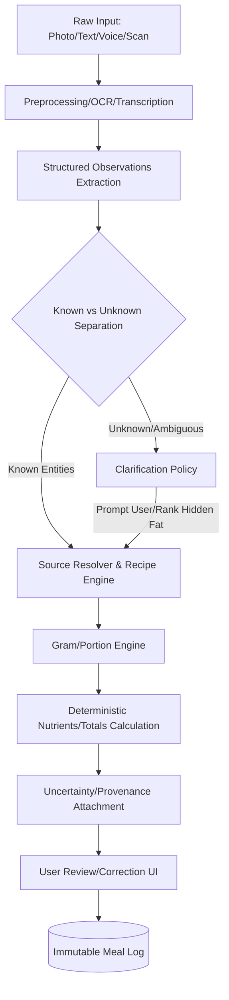

# Product Specification

This document comprehensively specifies the target product based on the agreed Master Build Plan v3. It acts as the canonical source of truth for the product features, behaviors, user flows, and technical requirements for the Nut AI platform.

## 1. Product Vision

Nut AI is **one unified personal performance platform** deeply connecting nutrition, bodyweight tracking, and strength training.
*   **Speed and Context-Awareness:** Quick enough for mid-workout interactions and meal-time logging (under 10 seconds).
*   **Depth and Analysis:** Deep enough for serious analysis on the web or desktop to dive into long-term trends, weekly reviews, and advanced programming.
*   **Offline-First & Sovereign:** Fully functional without an internet connection. The user's data remains on their device first, only syncing when required.

## 2. Target Platforms

*   **Android-First Production Priority:** The primary development target. Must feel native, fast, and respectful of Android UI/UX guidelines and background limits.
*   **Tech Stack:** Expo / React Native for mobile.
*   **iOS Support:** iOS builds are maintained where cross-platform support handles it automatically, but Android-specific optimizations take precedence.
*   **Synchronized Web/Desktop App:** A responsive web and desktop application will follow after the mobile core and sync are stabilized, utilizing local-first web technologies (IndexedDB/OPFS/SQLite-WASM).

## 3. Navigation Structure

The application is structured around 5 primary tabs:

1.  **Home**
    *   Today's calories, macros, and protein target progress.
    *   Bodyweight trend (mini-chart).
    *   Today's scheduled workout.
    *   Recent PRs (Personal Records) feed.
    *   Quick actions (Log Food, Start Workout, Add Weight).
    *   Daily completeness toggle.
    *   Active-workout mini-card (sticky when a workout is in progress).
2.  **Food**
    *   Today's meals and timeline.
    *   **Input Methods:** Camera, gallery, chat, barcode scanner, nutrition label scanner, manual search.
    *   **Saved Data:** Custom foods, recent/frequent/favorites, saved meals, recipes.
    *   **Quick Tools:** Copy-yesterday, usual-meal insert.
3.  **Train**
    *   Active workout interface.
    *   Quick workout launcher.
    *   Routines (user-created templates) and Programs (multi-week progressions).
    *   Exercise library (searchable, filterable by muscle/equipment).
    *   Custom exercises and equipment-aware suggestions.
    *   Workout history and analytics tools.
4.  **Progress**
    *   Overview dashboard.
    *   Strength trends (1RM, volume).
    *   Body trends (weight, measurements, progress photos).
    *   Nutrition trends (average intake, compliance).
    *   Combined trends (e.g., Bodyweight vs. Calories).
    *   Exportable reports.
5.  **You**
    *   Profile and Goals.
    *   Unit preferences (Metric/Imperial, precise rounding).
    *   Mode selection: Simple (streamlined UI) vs. Advanced (exposes RIR, tempos, micro-nutrients).
    *   Configuration: Utensils, Equipment inventory, Food sources, AI providers/keys.
    *   Privacy, sync settings, manual backup, and legal disclaimers.

## 4. Nutrition Input Pipeline

Nut AI supports multiple converging input methods that all result in a single structured meal representation.

### Supported Inputs
*   Camera photo, gallery photo, multiple meal photos.
*   Web file upload, clipboard paste.
*   Text/chat (English, Hinglish, Hindi transliterations).
*   Voice (future roadmap, routes through same text/intent path).
*   Barcode, nutrition-label scan, receipt scan.
*   Manual food search, custom food.
*   Saved meal, recipe, frequent item, recent item, favorite, yesterday copy, usual meal.

### Pipeline Architecture

## 5. India-First Food Intelligence

Nut AI is built with deep understanding of Indian dietary habits and regional variations.

*   **Canonical Concepts & Aliases:** Supports English, Hinglish, Hindi, and regional aliases natively.
    *   *Examples:* arhar/arahar/toor/tuvar/pigeon pea resolving to the same root concept; roti/chapati/phulka handling; dahi/curd.
*   **Preparation Differences:** Distinct tracking for items like litti/chokha, sattu, poha variants (Kande pohe vs Indori), dosa variants, biryani variants.
*   **Data Model Separation:** Clear distinction between `Food` (raw ingredient), `DishFamily` (Dal), `RecipeVersion` (Punjabi Tadka), `HouseholdRecipe` (My Mom's Dal), `Meal`, and `MealComponent`.
*   **Indian Household Measures:** Natively understands katori, bowl, glass, cup, tsp, tbsp, ladle, serving spoon, handful, piece/count, and custom user-defined utensils.
*   **Density/Portion References:** Built-in tables for cooked rice, thin/thick dal, rajma, chole, poha, upma, curd, sambar, and various gravies based on utensil volume.
*   **Recipe Model:** Tracks raw vs. cooked basis. Accounts for preparation method, added oil/ghee (critical), water/yield change, final cooked weight, and serving count/weight.
*   **Clarification Logic:** AI strictly prioritizes "hidden-fat questions" (e.g., "How much ghee was on the roti?") over minor spice questions (e.g., "Did you add jeera?"), ensuring frictionless logging.
*   **Household Learning:** Portions are tagged by provenance: measured, confirmed, learned, inferred, generic, or unknown. One-off corrections apply only to the specific meal unless the user explicitly promotes them to a household rule.

## 6. Nutrition Sources

All food items pull from a common `NutritionSource` interface via distinct adapters:

*   **IFCTSource:** Primary India-focused database (Indian Food Composition Tables). Authorized for public inclusion.
*   **USDASource:** Complementary/fallback database for generic whole foods and western items.
*   **OpenFoodFactsSource:** Separate license/provenance for barcoded and packaged goods.
*   **UserFoodSource:** User-created single items.
*   **HouseholdRecipeSource:** User-created composite recipes.

*Requirement:* The system MUST preserve per-source license, attribution, import version, source ID, and provenance for every logged micronutrient.

## 7. Portion and Evidence Hierarchy

Nutrient calculations use a strict evidence hierarchy to determine confidence:

1.  **Exact packaged serving/label arithmetic** (Highest confidence)
2.  **Discrete count with reliable unit mass** (e.g., 1 medium egg)
3.  **User-measured or learned household portion**
4.  **Known utensil/container/plate geometry** (e.g., standard katori)
5.  **Image/reference-object geometry**
6.  **Volume × food density**
7.  **Standard Indian portion prior** (Fallback)
8.  **Model estimate as weak evidence** (Lowest confidence)

*   **Logging Modes:**
    *   *Quick:* Minimal questions, wider range of uncertainty.
    *   *Accurate:* 1-3 targeted questions (usually regarding fats/oils).
    *   *Precise:* Measured ingredients in grams.
*   **Data Quality Inspector:** A UI component ("Why this number?") that shows the data source, recipe version, portion evidence, assumptions made, provenance, uncertainty contributors, and micronutrient coverage.

## 8. Full Strength Training System

*   **Exercise Tracking Types:** Weight+reps, Bodyweight+reps, Assisted, Reps only, Duration, Distance+duration, Weight+duration, Custom.
*   **Set Types:** Warm-up, Working, AMRAP, Failure, Drop set, Rest-pause, Assisted, Optional tempo.
*   **Planned vs Actual:** Explicit separation between planned values (`plannedLoad`, `plannedReps`, `plannedRIR`) and actual logged values (`actualLoad`, `actualReps`, `actualRIR`).
*   **Custom Exercises:** Name, tracking type, primary/secondary muscles, equipment requirements, notes/media, and aliases.
*   **Active Workout State:**
    *   Optimized for large touch targets.
    *   Displays previous values inline.
    *   Prefill/duplicate set functionality.
    *   Auto rest timer triggered on set completion.
    *   Exercise notes inline.
    *   Superset/circuit grouping.
    *   Add/reorder/replace exercises mid-workout.
    *   **Crucial:** Auto-save state to survive Android process death.
*   **Routines & Programs:** Routines are reusable single-day templates; Programs are multi-week schedules with progression rules.

## 9. Equipment and Plate Calculator

*   **Equipment Inventory:** User can define available equipment (count, type, bar/handle weight, plate weight/count).
*   **Plate Calculator:**
    *   Calculates symmetric loading.
    *   Respects the user's specific plate inventory (doesn't suggest 2.5kg plates if they don't own them).
    *   Rounds to the nearest valid load.
    *   Distinguishes between per-hand (dumbbells) vs. total (barbells) calculations.

## 10. PRs, Progression, Analytics

*   **PR Types:** Heaviest load, estimated 1RM, rep-range PRs (e.g., best 5-rep set), best set volume, total session volume, bodyweight/weighted/assisted PRs, duration, cardio distance.
*   **Analytics Views:** Strength progress, Hypertrophy workload (hard sets per muscle), External workload (tonnage), Internal effort (RIR/RPE trends), Consistency tracking.
*   **Progression Logic:** Supports double progression, fixed increment, percentage-based, RIR-based, manual, and program-defined progression schemes.
*   **No Fake Decimals:** Recovery scores and progression must be transparent. The system relies on context rather than arbitrary 0-100 "readiness" scores.

## 11. Day Completeness and Adaptive Check-in

*   **Day Status:** Each day is marked as `COMPLETE`, `PARTIAL`, `UNKNOWN`, or `FASTING`.
*   **Adaptive Logic:** Averages and trends *exclude* days marked as `PARTIAL` or `UNKNOWN` to prevent skewed data (e.g., artificially low average intake from forgetting to log dinner).
*   **Weekly Check-in:** A workflow reviewing weight trend, average intake, protein compliance, training consistency, and suggesting macro/program adjustments.
*   **Explicit Consent:** No changes to targets are active without explicit user acceptance.
*   **Safety Rules:** Hard-coded warnings and constraints for minors, pregnancy/lactation, and eating-disorder risks.

## 12. Timeline and Reports

*   **Unified Daily Timeline:** A single scrolling view showing food entries, bodyweight logs, measurements, workouts, check-ins, and PRs chronologically.
*   **Reports:** Weekly and monthly reports generated entirely from local structured data.
*   **Combined Charts:** Ability to overlay metrics (e.g., Protein Intake vs. Squat 1RM) without the app making unfounded causal claims.

## 13. Micronutrient Model

*   **Performance:** Calories and macros are computed instantly. Micronutrients are supported and calculated asynchronously/in background from day one.
*   **Data Fidelity:** Each micronutrient value stores its unit, amount, source, source version, and missing/estimated status.
*   **Missing ≠ Zero:** The UI explicitly differentiates between "0mg of Vitamin C" and "Unknown Vitamin C" and provides a "data coverage" score for the day.

## 14. Assistant and Chat

*   **One Unified Assistant:** Handles both food logging ("I ate 2 rotis") and training queries ("What was my last bench press?"). Queries structured records.
*   **Intent Types:** Distinct tools for read vs. write.
*   **Execution Policy:** Read queries execute directly and display UI cards. Write/Mutate queries require a user confirmation step (e.g., generating a workout routine).
*   **AI Fallback Order:**
    1.  Deterministic parser / Regex (Fastest, offline).
    2.  Local ONNX/TFLite model (Offline NLP).
    3.  Cloud Provider (OpenAI/Anthropic via BYO-Key).
    4.  Manual fallback UI.

## 15. Privacy and Security

*   **No Shared API Secrets:** The APK/Web bundle contains NO shared API keys for LLM providers.
*   **BYO Keys:** Users bring their own API keys, stored in OS secure storage (EncryptedSharedPreferences / Keychain).
*   **Media Privacy:** EXIF/GPS data is stripped from photos before any cloud processing.
*   **Retention:** Strict meal-photo retention policies (auto-delete after X days or after transcription).
*   **Medical Disclaimer:** Prominent requirements stating the app is not medical advice.

## 16. Offline Storage, Sync, Backup

*   **Storage:** Local-first SQLite database. A separate read-only attached database is used for the massive nutrition corpus (IFCT/USDA).
*   **Undo & Versioning:** Immediate undo for deletions. Recipe version history is maintained. Soft-delete is used across all critical tables.
*   **Backup:** Versioned JSON/SQLite backup format. Includes all user tables in Foreign-Key-safe order. Must be round-trip tested in CI.
*   **Sync:** Provider-independent interface. Supabase is the first adapter. Uses an idempotent queue for offline actions. Supports seamless local-to-account migration.

## 17. Non-Goals

To maintain focus and simplicity, Nut AI explicitly will **NOT** build:
*   Social feeds, leaderboards, or gamification.
*   Supplement marketplaces or meal delivery integrations.
*   Exercise-form camera scoring / CV pose estimation.
*   Smartwatch OS apps or GPS running tracker replacements.
*   A single abstracted "health score" (no arbitrary 1-100 metrics).
