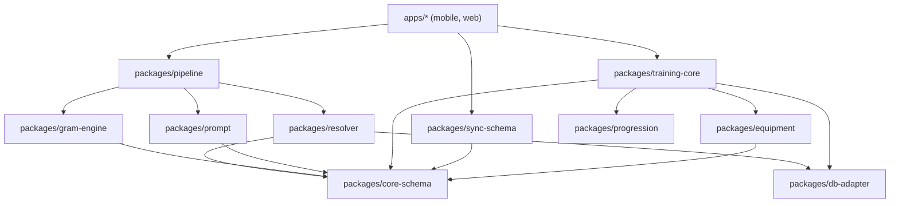
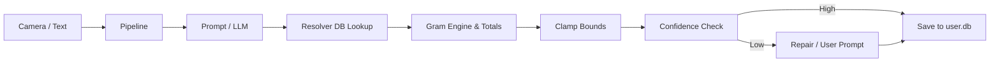
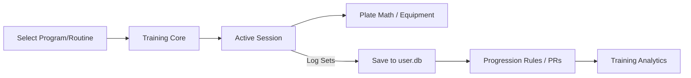
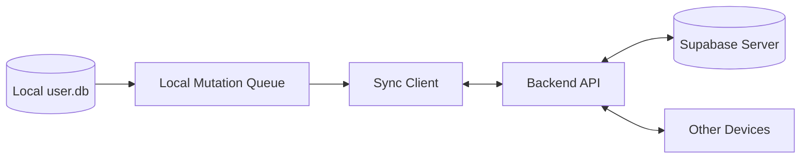

# Target Architecture

This document outlines the target architecture for the application, evolving from the current baseline to support the full product scope, including Indian nutrition data, comprehensive training features, local-first synchronization, and web platform support.

## 1. Current Architecture

The current repository is structured as an npm-workspaces monorepo.

### 1.1 Existing Structure
- `apps/mobile`: The frontend React Native application using Expo SDK 57.
- `packages/`: 11 Node-pure TypeScript packages containing domain logic, contracts, and core engine code.
- `eval/`: The accuracy harness for evaluating AI pipelines.
- `tools/nutrition-data/`: The build pipeline for USDA nutritional data.

### 1.2 Existing Data Flow
The primary nutrition flow is: `(Camera/Text) → Pipeline → Result`
1. Input is routed to the AI provider via the `prompt` package.
2. The `pipeline` package orchestrates extraction using schemas from `core-schema`.
3. The `resolver` package matches extracted food names to database rows.
4. `gram-engine` and `totals` reconcile serving sizes, weights, and macro targets.
5. `clamp` enforces deterministic sanity bounds.
6. `confidence` assesses certainty; if below threshold, `repair` prompts the user for clarification.
7. Final reconciled logs are recorded against the user's `goals`.

### 1.3 Two-Database Design
The architecture relies on a strict separation of data concerns:
- **`nutrition.db` (Read-only)**: Shipped with the app (or downloaded), containing reference datasets (USDA, etc.).
- **`user.db` (Writable)**: Local database containing user logs, goals, settings, and custom foods.

---

## 2. Target Architecture

The target state preserves the monorepo structure while expanding packages to support the new roadmap phases.

### 2.1 Proposed Package Structure

```text
apps/
  mobile/                    Expo/React Native routes and native adapters
  web/                       Responsive web app (after sync foundation)
packages/
  core-schema/               Runtime-validated domain and wire contracts (EXISTS)
  db-adapter/                Platform-neutral DB contract + Node adapter (EXISTS)
  pipeline/                  End-to-end nutrition pipeline (EXISTS)
  gram-engine/               Reconciliation ladder (EXISTS)
  resolver/                  Food name → database row (EXISTS)
  totals/                    Recompute, macro reconciliation (EXISTS)
  confidence/                Measured bands, structural widening (EXISTS)
  repair/                    Question bank, expected-value gating (EXISTS)
  goals/                     BMR/TDEE/macros, adaptive (EXISTS)
  prompt/                    Provider prompts and transforms (EXISTS)
  clamp/                     Deterministic sanity bounds (EXISTS)
  nutrition-sources/         Common source interface and routing (NEW)
  indian-ontology/           Aliases, normalization, dish families (NEW)
  recipe-engine/             Recipe versions, yield, household logic (NEW)
  training-core/             Exercises, sessions, sets, routines, programs (NEW)
  equipment/                 Inventory and plate loading (NEW)
  progression/               PRs and progression rules (NEW)
  training-analytics/        Pure derived metrics (NEW)
  search/                    Platform-neutral query/ranking contracts (NEW)
  sync-schema/               Sync envelopes/conflict semantics (NEW)
  reports/                   Deterministic report calculations (NEW)
eval/                        Nutrition/training evaluation harness (EXISTS)
tools/
  nutrition-data/            USDA build pipeline (EXISTS)
  ifct-import/               IFCT ingestion pipeline (NEW)
  fixtures/                  Licensed test fixtures (NEW)
supabase/                    Backend config (when sync phase begins)
docs/                        Documentation
```

### 2.2 Component Specifications

| Package / Module | Allowed Imports (Dependencies) | Forbidden Dependencies | Public API Surface | Test Type Required | Owning Phase |
| :--- | :--- | :--- | :--- | :--- | :--- |
| **`apps/mobile`** | All `packages/*` | None (from monorepo) | App UI / Routes | E2E (Maestro), Unit | 1-5 (Ongoing) |
| **`apps/web`** | All `packages/*` | `apps/mobile` | App UI / Routes | E2E (Playwright), Unit | 6 |
| **`core-schema`** | None | DB logic, RN/Expo, External API | Zod schemas, TS types | Unit (Pure Node) | 1 |
| **`db-adapter`** | `core-schema` | RN/Expo, UI | `DatabaseAdapter` interface | Integration (Node DB) | 1 |
| **`pipeline`** | `core-schema`, `prompt`, `resolver`, `gram-engine`, `totals`, `clamp`, `confidence`, `repair` | UI, RN/Expo | Pipeline orchestrator fn | Unit, Integration | 1 |
| **`gram-engine`** | `core-schema` | UI, RN/Expo | Reconciliation logic | Unit (Pure Node) | 1 |
| **`resolver`** | `core-schema`, `db-adapter`, `search` | UI, RN/Expo | Food lookup fns | Unit, Integration | 1 |
| **`totals`** | `core-schema` | UI, RN/Expo | Aggregation fns | Unit (Pure Node) | 1 |
| **`confidence`** | `core-schema` | UI, RN/Expo | Scoring fns | Unit (Pure Node) | 1 |
| **`repair`** | `core-schema` | UI, RN/Expo | Question generators | Unit (Pure Node) | 1 |
| **`goals`** | `core-schema` | UI, RN/Expo | BMR/TDEE calculators | Unit (Pure Node) | 1 |
| **`prompt`** | `core-schema` | UI, RN/Expo | Prompt templates, parsers | Unit (Pure Node) | 1 |
| **`clamp`** | `core-schema` | UI, RN/Expo | Sanity bounds validators | Unit (Pure Node) | 1 |
| **`nutrition-sources`**| `core-schema`, `db-adapter` | UI, RN/Expo | Source abstractions | Unit, Integration | 2 |
| **`indian-ontology`** | `core-schema`, `nutrition-sources` | UI, RN/Expo | Aliases, normalizers | Unit (Pure Node) | 2 |
| **`recipe-engine`** | `core-schema`, `gram-engine` | UI, RN/Expo | Recipe calculators | Unit (Pure Node) | 2 |
| **`training-core`** | `core-schema`, `db-adapter` | UI, RN/Expo | Exercise/Session models | Unit, Integration | 3 |
| **`equipment`** | `core-schema`, `training-core` | UI, RN/Expo | Plate math, inventory | Unit (Pure Node) | 3 |
| **`progression`** | `core-schema`, `training-core` | UI, RN/Expo | PR tracking, rules | Unit (Pure Node) | 3 |
| **`training-analytics`**| `core-schema`, `training-core` | UI, RN/Expo | Derived metric fns | Unit (Pure Node) | 3 |
| **`search`** | `core-schema`, `db-adapter` | UI, RN/Expo | Query contracts, rankers | Unit, Integration | 4 |
| **`sync-schema`** | `core-schema` | UI, RN/Expo | Sync envelopes, CRDTs | Unit (Pure Node) | 5 |
| **`reports`** | `core-schema`, `training-analytics` | UI, RN/Expo | Report calculators | Unit (Pure Node) | 6 |

---

## 3. Diagrams

### 3.1 Package Dependency Graph (Allowed Directions)


### 3.2 Nutrition Data Flow


### 3.3 Training Data Flow


### 3.4 Sync Data Flow


---

## 4. Architectural Principles and Decisions

### 4.1 Node-Purity Enforcement
All code residing in `packages/*` must be strictly Node-pure. 
- **Rule**: They cannot import `react-native`, `expo`, or any mobile UI-specific libraries.
- **Why**: This ensures domain logic can be tested instantly using fast Node tools (like Jest or Vitest) without native compilation. It enables the `eval` harness to run at maximum speed, allows logic to be executed in serverless environments if ever needed, and guarantees compatibility with the future `apps/web` application.

### 4.2 Expo SQLite Adapter Location
- **Decision**: The actual Expo SQLite implementation resides in `apps/mobile/src/db`, while `packages/db-adapter` only defines the interfaces and a Node-compatible implementation (e.g., `better-sqlite3`).
- **Why**: If `packages/db-adapter` imported `expo-sqlite`, it would break Node purity. By defining an interface in the package layer, `apps/mobile` can implement that interface using native tools and inject it into the packages at runtime (Dependency Injection). This keeps packages completely agnostic of the runtime environment.

### 4.3 Web Framework Decision
- **Decision**: The web version will be a completely separate application (`apps/web`) using standard React DOM (e.g., Next.js or Vite).
- **Why**: Rather than forcing `react-native-web` upon the entire UI, separating the web app allows for platform-native UI patterns (responsive CSS, standard DOM elements) while still sharing 100% of the business logic, schemas, and DB contracts (via a WebAssembly SQLite adapter) from `packages/*`.

### 4.4 When to Create a New Package
Follow this heuristic:
- **Create a new package** when:
  - The domain logic is distinct and has different primary dependencies.
  - The code can be versioned, tested, or deployed independently.
  - It serves as a foundational building block for multiple other packages (e.g., `core-schema`).
- **Keep as a module inside an existing package** when:
  - The logic is tightly coupled to the package's primary purpose.
  - It serves only one consumer package.
  - It shares the exact same lifecycle and test suite context.
