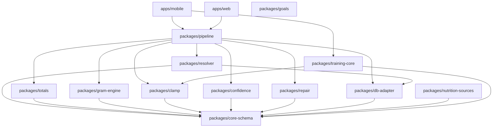

# Package and Dependency Map

This document outlines the architecture, ownership, and dependency rules for the monorepo packages.

## 1. Node-Purity Enforcement
All packages in the `packages/*` directory MUST remain strictly Node-pure. They cannot depend on React Native, Expo, or DOM APIs. This ensures the business logic (parsing, calculating, pipeline resolving) can be run in CI environments, CLI tools, and background workers without native build steps.

**Forbidden Imports:**
- `react-native`
- `expo` (or any `@expo/*` module)
- `apps/*` (packages must never depend on the application layer)

## 2. Phase Ownership & Dependencies

| Package | Phase Ownership | Description | Dependencies | Test Type |
|---------|-----------------|-------------|--------------|-----------|
| `core-schema` | Phase 1 (Complete) | Zod schemas and DB types | None | Unit |
| `db-adapter` | Phase 1 (Complete) | SQLite abstractions | `core-schema` | Integration |
| `clamp` | Phase 1 (Complete) | Math utilities | `core-schema` | Unit |
| `totals` | Phase 1 (Complete) | Macro aggregation | `core-schema` | Property Tests |
| `goals` | Phase 1 (Complete) | Goal calculations | None | Unit |
| `gram-engine` | Phase 1 (Complete) | Volume-to-weight conversions | `core-schema` | Unit |
| `resolver` | Phase 1 (Complete) | Search resolution | `core-schema`, `db-adapter` | DB Fixtures |
| `confidence` | Phase 1 (Complete) | Scoring algorithms | `core-schema` | Unit |
| `repair` | Phase 1 (Complete) | Data healing | `core-schema` | Unit |
| `pipeline` | Phase 1 (Complete) | End-to-end processing | `clamp`, `gram-engine`, `resolver`, `totals`, `confidence`, `repair`, `db-adapter` | DB Fixtures |
| `nutrition-sources` | Phase 2 | API clients (OFF, IFCT) | `core-schema` | Mocked API |
| `training-core` | Phase 3 | Workout logic | `core-schema`, `clamp` | Property Tests |

*Note: As per the audit, `totals` depends on `core-schema` (NOT `gram-engine`), and `goals` has zero internal dependencies.*

## 3. Public API Surface

Each package must explicitly export its public API via `index.ts`. Internal utility files should not be deeply imported.

**Example Exports:**
- `totals`: `calculateDayTotals`, `aggregateMealMacros`, `calculateDeficit`
- `pipeline`: `processLogString`, `rehydrateMeal`
- `gram-engine`: `convertToGrams`, `getDensityForCategory`
- `clamp`: `clampToZero`, `roundMacro`, `safeDivide`

## 4. Dependency Diagram

