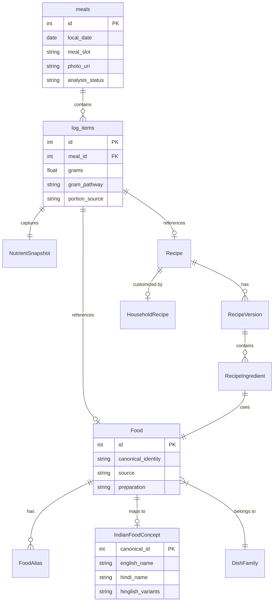
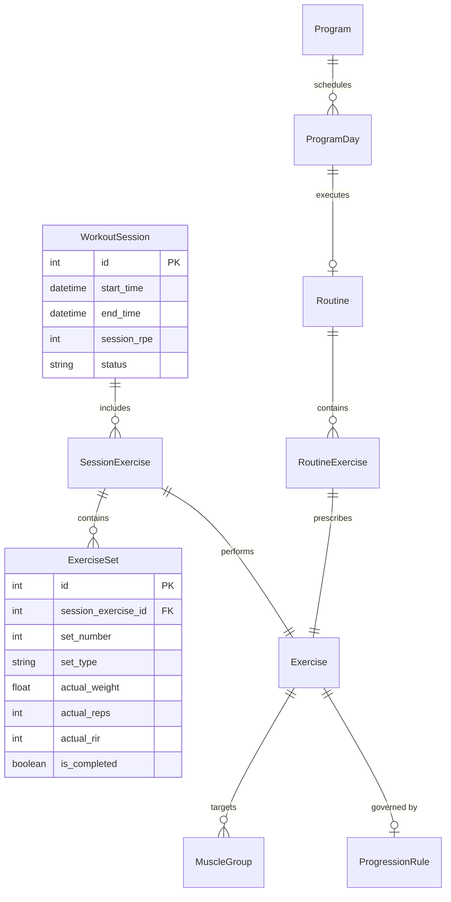
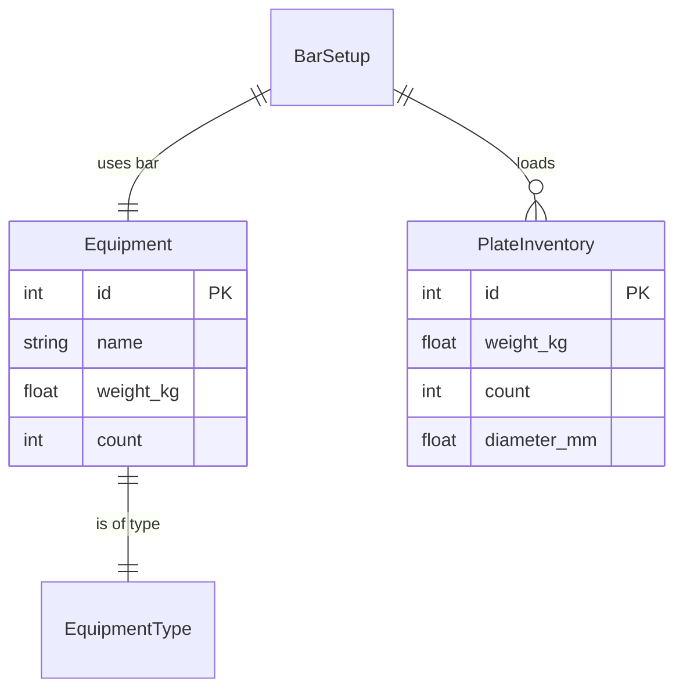
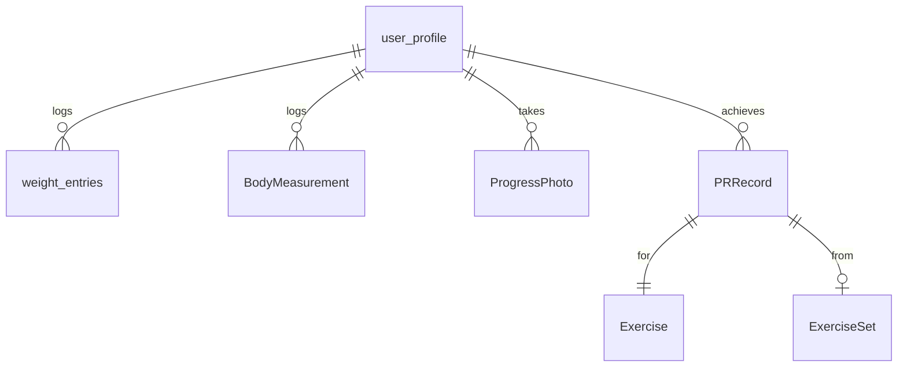
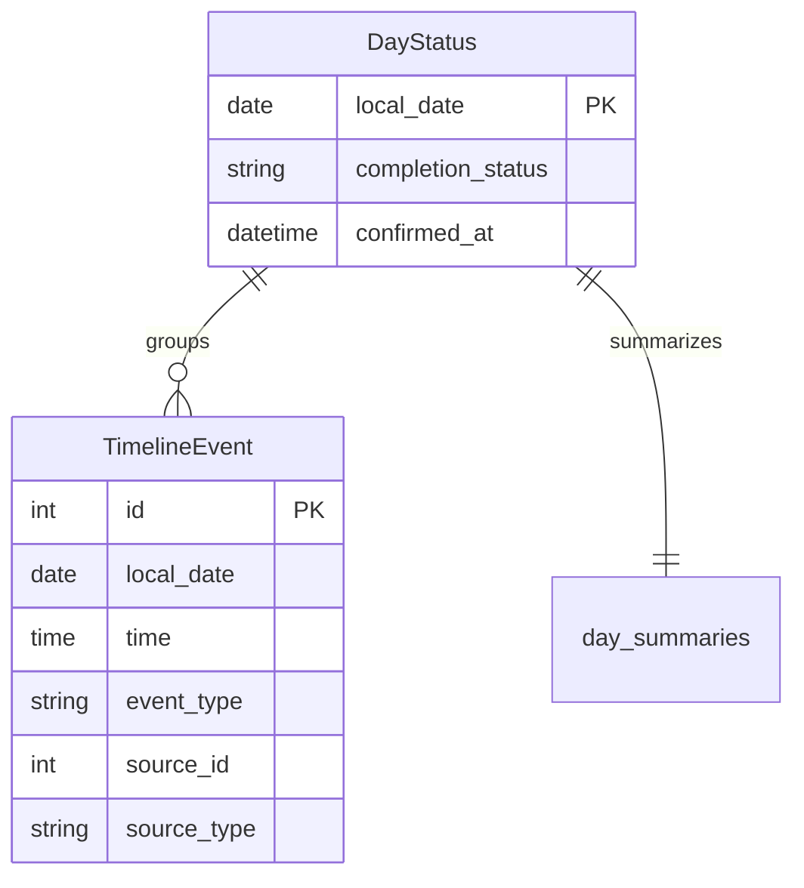
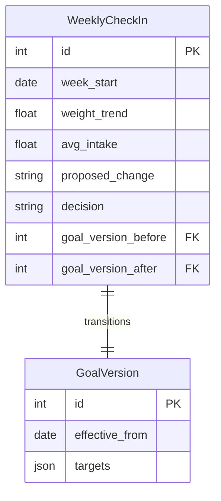
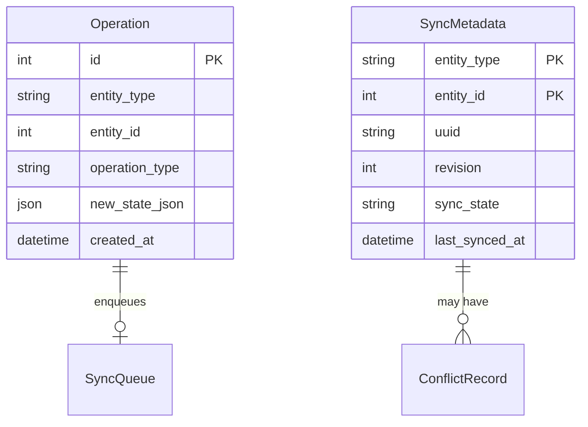
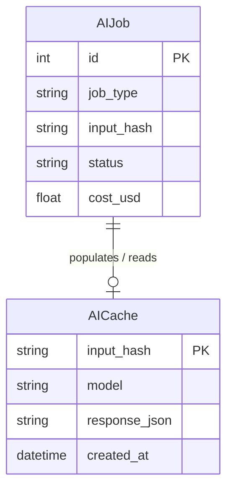

# Domain Model Specification

## 1. Overview

This document specifies the complete domain model for the India-first nutrition and training platform. It covers the core entities, their attributes, and relationships, partitioned into functional domains.

### Legend
*   **(v1)**: Entity exists in the current schema v1.
*   **(Extended)**: Entity exists in v1 but is being extended with new attributes or relationships.
*   **(New)**: Completely new entity introduced in this target architecture.

---

## 2. Nutrition Domain

The Nutrition Domain handles everything related to food, recipes, meal logging, and nutritional data, with a strong focus on Indian dietary patterns.

### Entities
*   **Food (New)**: Canonical identity, nutrients, source, preparation.
*   **FoodAlias (New)**: Aliases for foods (food_id, alias, language, alias_type).
*   **IndianFoodConcept (New)**: Canonical_id, english_name, hindi_name, hinglish variants, regional names.
*   **DishFamily (New)**: Regional identity, generic priors (e.g., "Dal", "Roti").
*   **Recipe (New)**: Ingredients, method, yield, source/version.
*   **HouseholdRecipe (New)**: Versioned personal overrides for standard recipes.
*   **RecipeVersion (New)**: Ingredients list, method, yield change per version.
*   **RecipeIngredient (New)**: food_id, quantity, unit, preparation, basis.
*   **meals (Extended)**: Meal instances (logged_at, local_date, meal_slot, photo_uri, analysis_status, time, type, totals, provenance).
*   **log_items / MealComponent (Extended)**: Items within a meal (meal_id, immutable per-100g snapshots, grams, gram_pathway, portion_source, assumptions).
*   **NutrientSnapshot (New)**: Immutable per-100g data at log time, source, version, coverage.
*   **user_foods (v1)**: Custom foods created by the user.
*   **saved_meals (v1)**: Saved meal templates (items_json).
*   **food_attribute_memory (v1)**: User's historical preferences/attributes for a food concept.
*   **personal_gram_priors (v1)**: EWMA corrections for portion sizes.
*   **user_containers (v1)**: Household containers (label, type, usable_ml, diameter_mm).
*   **water_entries (v1)**: Water intake logs.

### Entity-Relationship Diagram

---

## 3. Training Domain

The Training Domain manages exercises, workout routines, programs, and individual session tracking.

### Entities
*   **Exercise (New)**: id, name, tracking_type, primary_muscles[], secondary_muscles[], equipment, is_builtin, aliases.
*   **CustomExercise (New)**: Extends Exercise with user ownership.
*   **MuscleGroup (New)**: id, name, display_name.
*   **WorkoutSession (New)**: start_time, end_time, location, template_id, status, session_rpe, notes.
*   **SessionExercise (New)**: session_id, exercise_id, sort_order, rest_seconds, notes.
*   **ExerciseSet (New)**: session_exercise_id, set_number, set_type, planned_weight/reps/rir, actual_weight/reps/rir, duration, distance, is_completed.
*   **Routine (New)**: name, description.
*   **RoutineExercise (New)**: routine_id, exercise_id, sets_prescribed, rep_range, rest_seconds.
*   **Program (New)**: name, duration_weeks, description.
*   **ProgramDay (New)**: program_id, week, day, routine_id.
*   **ProgressionRule (New)**: exercise_id, rule_type, parameters.
*   **exercise_entries (Extended)**: Simple logging (name, kcal, provenance).

### Entity-Relationship Diagram

---

## 4. Equipment Domain

Tracks available equipment for precise workout logging and progression.

### Entities
*   **Equipment (New)**: id, name, type, weight_kg, count, is_custom.
*   **EquipmentType (New)**: Enum (barbell, dumbbell_handle, ez_bar, straight_bar, plate, cable, machine, other).
*   **PlateInventory (New)**: weight_kg, count, diameter_mm.
*   **BarSetup (New)**: bar_id, plates_per_side[], total_weight.

### Entity-Relationship Diagram

---

## 5. Body and Progress Domain

Tracks physiological changes and physical achievements.

### Entities
*   **user_profile (v1)**: Singleton configuration (id=1).
*   **WeightEntry / weight_entries (Extended)**: local_date unique, weight_kg, source.
*   **BodyMeasurement (New)**: date, type, value, unit.
*   **ProgressPhoto (New)**: local_uri, sync_status, date, body_part, is_private.
*   **PRRecord (New)**: exercise_id, pr_type, value, achieved_at, set_id.

### Entity-Relationship Diagram

---

## 6. Day and Timeline Domain

Provides a chronological view of the user's journey.

### Entities
*   **day_summaries (v1)**: Derived, droppable aggregates per day.
*   **DayStatus (New)**: local_date, completion_status, confirmed_at.
*   **TimelineEvent (New)**: local_date, time, event_type, source_id, source_type.

### Entity-Relationship Diagram

---

## 7. Adaptive Domain

Manages dynamic goal setting and the weekly check-in process.

### Entities
*   **goals / GoalVersion (Extended)**: append-only, effective_from, extended with version tracking.
*   **WeeklyCheckIn (New)**: week_start, weight_trend, avg_intake, eligible_days, protein_avg, training_adherence, proposed_change, decision, goal_version_before, goal_version_after.

### Entity-Relationship Diagram

---

## 8. Operations and Sync Domain

Provides offline-first capability through local operation tracking and synchronization queues.

### Entities
*   **Operation (New)**: id, entity_type, entity_id, operation_type, previous_state_json, new_state_json, created_at, undone_at.
*   **SyncMetadata (New)**: entity_type, entity_id, uuid, revision, sync_state, last_synced_at, deleted_at.
*   **SyncQueue (New)**: id, operation_id, status, retry_count.
*   **ConflictRecord (New)**: entity_type, entity_id, local_revision, remote_revision, resolution, resolved_at.
*   **consents, settings, accuracy_baselines (v1)**: App configuration.

### Entity-Relationship Diagram

---

## 9. AI Domain

Manages interactions with LLMs and caches responses to optimize latency and cost.

### Entities
*   **AIJob (New)**: id, job_type, input_hash, provider, model, status, cost_usd, created_at.
*   **AICache (New)**: input_hash, provider, model, prompt_version, response_json, created_at.
*   **scan_cost_ledger, scan_cache (v1)**: Legacy equivalents, to be merged/replaced by AIJob/AICache.

### Entity-Relationship Diagram

