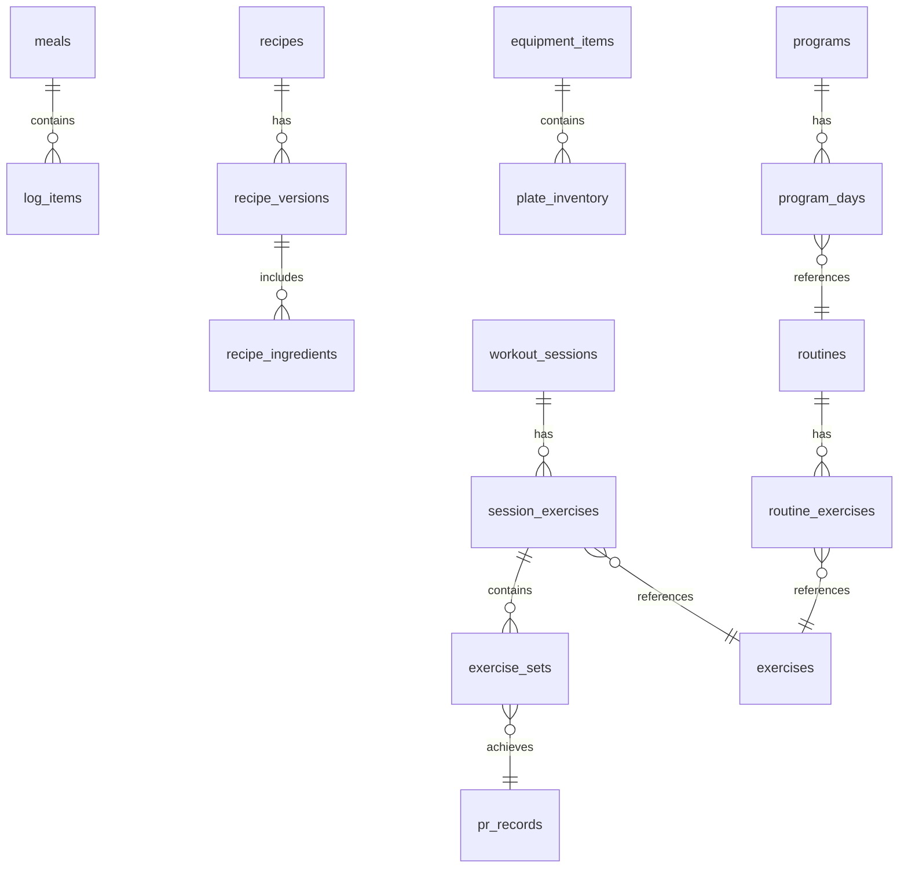

# Database Schema and Migrations

This document specifies the database schema evolution plan for the application, detailing the current baseline, the migration strategy, and the sequence of planned migrations up to version 11.

## Current Schema (v1)
The current `user.db` schema includes these tables (all using `INTEGER PRIMARY KEY`):
- `schema_migrations`, `user_profile` (singleton id=1), `goals` (append-only)
- `user_foods`, `meals`, `log_items` (with immutable nutrient snapshots)
- `weight_entries`, `water_entries`, `exercise_entries` (calorie-only)
- `day_summaries` (derived), `personal_gram_priors`, `food_attribute_memory`
- `user_containers`, `saved_meals`, `scan_cost_ledger`, `scan_cache`
- `consents`, `settings`, `accuracy_baselines`

The `nutrition.db` (read-only) includes:
- `brands`, `foods`, `food_micros` (sparse EAV), `food_portions`, `food_synonyms`
- `build_manifest`, `food_fts`, `food_fts_trigram` (FTS5)

## Migration Strategy

### Critical Rules
1. **NEVER edit migration v1** (it has already shipped).
2. **Forward-only migrations**: Each migration gets a new version number.
3. **Transaction safety**: Each migration is its own transaction.
4. **Testing**: Migration tests must run from every shipped version.
5. **Backup integrity**: Every new table must be added to the backup `EXPORT_TABLES` allowlist.

### Planned Migration Sequence

#### v2: Identity and Sync Foundation
- Add UUID columns to syncable entities (`meals`, `log_items`, `weight_entries`, `exercise_entries`, `user_foods`, `saved_meals`, `user_containers`, `goals`).
- Add sync metadata columns: `uuid TEXT`, `created_at INTEGER`, `updated_at INTEGER`, `revision INTEGER DEFAULT 1`, `deleted_at INTEGER`, `sync_state TEXT DEFAULT 'local'`.
- Generate UUIDs for existing rows (one-time migration).
- Keep `INTEGER PRIMARY KEY` for SQLite efficiency.
- Add unique index on `uuid` columns.

#### v3: Day Completeness
- `CREATE TABLE day_status (local_date TEXT PRIMARY KEY, completion TEXT NOT NULL DEFAULT 'unknown', confirmed_at INTEGER, updated_at INTEGER NOT NULL, actor TEXT NOT NULL DEFAULT 'user', provenance TEXT)`
- Completion values are canonical lowercase: `'complete'`, `'partial'`, `'unknown'`, `'fasting'`.

#### v4: Operations and Undo
- `CREATE TABLE operations (id INTEGER PRIMARY KEY, uuid TEXT NOT NULL UNIQUE, entity_type TEXT NOT NULL, entity_id INTEGER NOT NULL, op_type TEXT NOT NULL, prev_json TEXT, new_json TEXT, actor TEXT NOT NULL DEFAULT 'user', idempotency_key TEXT, created_at INTEGER NOT NULL, undone_at INTEGER)`
- Create index on `(entity_type, entity_id)` and unique index on `idempotency_key WHERE idempotency_key IS NOT NULL`.

#### v5: Recipe System
- `CREATE TABLE recipes (id INTEGER PRIMARY KEY, uuid TEXT UNIQUE, name TEXT NOT NULL, dish_family TEXT, cuisine TEXT, is_household INTEGER DEFAULT 0, current_version INTEGER DEFAULT 1, created_at INTEGER, updated_at INTEGER, deleted_at INTEGER, sync_state TEXT DEFAULT 'local')`
- `CREATE TABLE recipe_versions (id INTEGER PRIMARY KEY, recipe_id INTEGER REFERENCES recipes(id), version INTEGER NOT NULL, yield_grams REAL, servings REAL, method TEXT, oil_ml REAL, notes TEXT, created_at INTEGER NOT NULL)`
- `CREATE TABLE recipe_ingredients (id INTEGER PRIMARY KEY, recipe_version_id INTEGER REFERENCES recipe_versions(id), food_source TEXT, food_source_id TEXT, display_name TEXT NOT NULL, quantity REAL NOT NULL, unit TEXT NOT NULL, preparation TEXT, basis TEXT DEFAULT 'raw', snap_energy_kcal REAL, snap_protein_g REAL, snap_fat_g REAL, snap_carb_g REAL, sort_order INTEGER DEFAULT 0)`

#### v6: Indian Food Extensions
- `CREATE TABLE food_aliases (id INTEGER PRIMARY KEY, food_concept_key TEXT NOT NULL, alias TEXT NOT NULL, language TEXT DEFAULT 'en', alias_type TEXT DEFAULT 'synonym')`
- `CREATE INDEX idx_aliases_key ON food_aliases(food_concept_key)`
- `CREATE INDEX idx_aliases_alias ON food_aliases(alias)`
- Populate with initial high-frequency Indian aliases.

#### v7: Training Foundation
- `CREATE TABLE exercises (id INTEGER PRIMARY KEY, uuid TEXT UNIQUE, name TEXT NOT NULL, tracking_type TEXT NOT NULL, primary_muscles TEXT, secondary_muscles TEXT, equipment TEXT, is_builtin INTEGER DEFAULT 0, is_custom INTEGER DEFAULT 0, aliases TEXT, notes TEXT, created_at INTEGER, updated_at INTEGER, deleted_at INTEGER, sync_state TEXT DEFAULT 'local')`
- `CREATE TABLE workout_sessions (id INTEGER PRIMARY KEY, uuid TEXT UNIQUE, started_at INTEGER NOT NULL, ended_at INTEGER, local_date TEXT NOT NULL, location TEXT, template_type TEXT, template_id INTEGER, status TEXT NOT NULL DEFAULT 'active', session_rpe INTEGER, notes TEXT, created_at INTEGER, updated_at INTEGER, deleted_at INTEGER, sync_state TEXT DEFAULT 'local')`
- `CREATE TABLE session_exercises (id INTEGER PRIMARY KEY, session_id INTEGER REFERENCES workout_sessions(id), exercise_id INTEGER REFERENCES exercises(id), sort_order INTEGER NOT NULL, rest_seconds INTEGER, permanent_note TEXT, session_note TEXT, superset_group INTEGER, created_at INTEGER)`
- `CREATE TABLE exercise_sets (id INTEGER PRIMARY KEY, session_exercise_id INTEGER REFERENCES session_exercises(id), set_number INTEGER NOT NULL, set_type TEXT NOT NULL DEFAULT 'working', planned_weight REAL, planned_reps INTEGER, planned_rir INTEGER, planned_duration INTEGER, actual_weight REAL, actual_reps INTEGER, actual_rir INTEGER, actual_duration REAL, actual_distance REAL, is_completed INTEGER DEFAULT 0, completed_at INTEGER, notes TEXT, sort_order INTEGER)`
- `CREATE INDEX idx_sessions_date ON workout_sessions(local_date)`
- `CREATE INDEX idx_sets_session ON exercise_sets(session_exercise_id)`
- Preserve existing `exercise_entries` table for legacy calorie data.

#### v8: Equipment
- `CREATE TABLE equipment_items (id INTEGER PRIMARY KEY, uuid TEXT UNIQUE, name TEXT NOT NULL, equipment_type TEXT NOT NULL, weight_kg REAL, count INTEGER DEFAULT 1, is_custom INTEGER DEFAULT 1, notes TEXT, created_at INTEGER, updated_at INTEGER, sync_state TEXT DEFAULT 'local')`
- `CREATE TABLE plate_inventory (id INTEGER PRIMARY KEY, equipment_item_id INTEGER REFERENCES equipment_items(id), weight_kg REAL NOT NULL, count INTEGER NOT NULL, diameter_mm REAL)`

#### v9: Routines and Programs
- `CREATE TABLE routines (id INTEGER PRIMARY KEY, uuid TEXT UNIQUE, name TEXT NOT NULL, notes TEXT, created_at INTEGER, updated_at INTEGER, deleted_at INTEGER, sync_state TEXT DEFAULT 'local')`
- `CREATE TABLE routine_exercises (id INTEGER PRIMARY KEY, routine_id INTEGER REFERENCES routines(id), exercise_id INTEGER REFERENCES exercises(id), sort_order INTEGER, sets_count INTEGER, rep_range_low INTEGER, rep_range_high INTEGER, rir_target INTEGER, rest_seconds INTEGER, notes TEXT, superset_group INTEGER)`
- `CREATE TABLE programs (id INTEGER PRIMARY KEY, uuid TEXT UNIQUE, name TEXT NOT NULL, duration_weeks INTEGER, description TEXT, created_at INTEGER, updated_at INTEGER, deleted_at INTEGER, sync_state TEXT DEFAULT 'local')`
- `CREATE TABLE program_days (id INTEGER PRIMARY KEY, program_id INTEGER REFERENCES programs(id), week_number INTEGER NOT NULL, day_number INTEGER NOT NULL, routine_id INTEGER REFERENCES routines(id), notes TEXT)`

#### v10: Body Measurements and PRs
- `CREATE TABLE body_measurements (id INTEGER PRIMARY KEY, uuid TEXT UNIQUE, local_date TEXT NOT NULL, measurement_type TEXT NOT NULL, value REAL NOT NULL, unit TEXT NOT NULL, created_at INTEGER, sync_state TEXT DEFAULT 'local')`
- `CREATE TABLE progress_photos (id INTEGER PRIMARY KEY, uuid TEXT UNIQUE, local_uri TEXT NOT NULL, local_date TEXT NOT NULL, body_area TEXT, is_private INTEGER DEFAULT 1, sync_status TEXT DEFAULT 'local', created_at INTEGER)`
- `CREATE TABLE pr_records (id INTEGER PRIMARY KEY, exercise_id INTEGER REFERENCES exercises(id), pr_type TEXT NOT NULL, value REAL NOT NULL, secondary_value REAL, achieved_at INTEGER NOT NULL, set_id INTEGER, workout_session_id INTEGER, created_at INTEGER)`

#### v11: Weekly Check-ins
- `CREATE TABLE weekly_checkins (id INTEGER PRIMARY KEY, uuid TEXT UNIQUE, week_start TEXT NOT NULL, weight_trend_kg REAL, avg_intake_kcal REAL, eligible_day_count INTEGER, protein_avg_g REAL, training_sessions_planned INTEGER, training_sessions_completed INTEGER, proposed_kcal_change REAL, decision TEXT, goal_version_before INTEGER, goal_version_after INTEGER, calculation_version TEXT, created_at INTEGER)`

## Backup Impact
- Every migration that adds tables must update `EXPORT_TABLES` in `backup-core.ts`.
- The backup format version must be bumped for each structural change.
- All new tables must be exported in FK-safe order.

## Important Constraints
- **UUIDs**: UUIDs are `TEXT` columns stored alongside `INTEGER` PKs (they do not replace them).
- **Timestamps**: All timestamps are Unix epoch integers.
- **Dates**: `local_date` is `TEXT 'YYYY-MM-DD'` (timezone-safe).
- **Null Values**: Nutrient values that are `NULL` mean 'unknown' (not zero).
- **JSON Columns**: JSON columns use the `_json` suffix.
- **Sync Columns**: Sync-related columns are optional until the sync phase begins.

## Complete Target Schema Diagram

