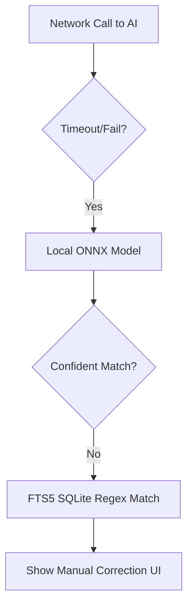

# Nutrition Engine Specification

## Overview
The Nutrition Engine is the core component responsible for transforming various forms of user inputs (text, voice, image, barcode, manual entry) into structured, highly accurate, and precise nutritional logs. It separates the process into deterministic algorithms and AI-assisted heuristics to ensure consistency and speed while remaining flexible.

## 1. Input Convergence
All input methods (barcode, text, audio, image, manual search, quick add) eventually converge into a common structured representation of a `MealLogRequest`. 

```typescript
interface MealLogRequest {
  raw_input?: string; // Text, OCR text, or transcription
  images?: string[]; // URIs
  barcode?: string;
  items: PartialMealItem[];
  timestamp: Date;
  timezone: string;
}
```

## 2. Pipeline Stages
The processing pipeline executes the following stages:

1. **Input**: Receiving data from sources.
2. **Preprocessing**: Normalization, basic unit conversions, barcode lookups.
3. **Observations**: Extracting recognized entities (foods, brands, units, quantities).
4. **Known/Unknown Separation**: Distinguishing confidently matched items from unresolved ones.
5. **Clarification**: Interactive resolution of unknowns.
6. **Resolver**: Matching canonical database concepts to text/entities.
7. **Recipe Engine**: Resolving compound foods and calculating exact totals based on retention factors and yields.
8. **Gram Engine**: Converting descriptive household measures (e.g., '1 cup') to exact gram weights using density databases.
9. **Totals**: Calculating macro/micronutrients.
10. **Confidence & Provenance**: Storing the origin of the matching data (verified, inferred, unknown) and confidence score.
11. **Review**: Presenting the finalized payload to the user for approval.
12. **Immutable Log**: Saving a hardcoded, per-100g snapshot of the food data in the DB.

## 3. Existing Packages & Roles
- `@nutai/gram-engine`: Handles unit-to-gram conversion, leveraging a density database (USDA, IFCT).
- `@nutai/resolver`: Resolves natural language or parsed entities to internal canonical IDs.
- `@nutai/totals`: Computes exact macronutrient and micronutrient totals based on amounts.
- `@nutai/confidence`: Scores certainty (0.0 to 1.0) and assigns provenance types.
- `@nutai/repair`: Attempts to fix invalid/impossible inputs (e.g., "1kg salt" -> warning/clamp).
- `@nutai/clamp`: Enforces physical constraints (e.g., protein + fat + carbs + water <= total mass).
- `@nutai/pipeline`: Coordinates the stages.

## 4. NutritionSource Interface
The engine relies on external and internal data sources, abstracted by `NutritionSource`.

```typescript
interface NutritionSource {
  id: string;
  priority: number;
  search(query: string): Promise<FoodItem[]>;
  resolve(id: string): Promise<FoodItem>;
  getDensity(id: string): Promise<DensityMap>;
}
```
*Priority*: Household Recipes (1) -> Custom Foods (2) -> Local DB (IFCT, USDA) (3) -> OpenFoodFacts (4) -> Generic AI Estimation (5).

## 5. Evidence Hierarchy for Portion Estimation
When precise weights are not available:
1. Exact gram weight provided.
2. Exact standard unit + density (e.g., "1 cup of milk").
3. Vague household measure + known density (e.g., "1 slice of pizza").
4. Visual estimation (AI volume detection).
5. Population average portion size.

## 6. Modes (Quick / Accurate / Precise)
- **Quick**: Fastest logging, high tolerance for AI estimation, no manual clarifications.
- **Accurate**: Balanced mode (default). Asks clarification for major calorie contributors.
- **Precise**: Enforces exact gram inputs, prompts for every missing detail.

## 7. Hidden-Ingredient & Clarification Engine
Automatically identifies implicit ingredients (e.g., oil in fried food).
*Question Value (QV)*: Questions are ranked by `QV = Expected Caloric Reduction / User Effort`. 
If QV exceeds a threshold, the user is prompted; otherwise, the engine infers safe defaults and marks provenance as 'Inferred'.

## 8. Data Quality Inspector
A UI feature answering "Why this number?". Explains the origin of every value (e.g., "USDA 12345", "Inferred 10g oil", "User input 150g").

## 9. Immutable Snapshot
At log time, the exact macros per 100g and the ingested amount are copied to the `MealLog` table. Subsequent updates to the original food item in the DB do *not* alter past logs unless requested.

## 10. Offline Behavior & Error Handling
- **Offline**: Uses Local DB and on-device NLP parsers. AI fallback fails gracefully to manual search. Images are queued for later cloud processing unless local OCR handles it.
- **Error Handling**: Missing API keys or network timeouts cascade immediately to the next available source or local resolver. Errors at the Totals stage prompt the user with "Unable to calculate".

## 11. Multi-Lingual and Hindi/Hinglish Parsing
The engine natively supports Indian languages through the pipeline:
- **Transliteration Normalization**: "katori", "katorii", "bowl" normalize to the same semantic unit before querying.
- **Language Detection**: The AI parser explicitly handles code-mixed text (e.g., "Main ne 2 roti aur palak paneer khaya").
- **Resolution**: Hindi and regional aliases are indexed in SQLite FTS5 for direct substring matches without needing LLM reasoning.

## 12. Clarification Question Priority Algorithm
When the `Known/Unknown Separation` stage yields ambiguous items, the engine scores potential questions.
- **Formula**: `QV (Question Value) = (Max Possible Calories - Min Possible Calories) / Cognitive Load`
- Only questions with `QV > Threshold` are shown to the user.
- E.g., "Was there oil in the dal?" (High QV). "Did you add turmeric?" (Low QV, skipped).

## 13. Offline Fallback Flow

